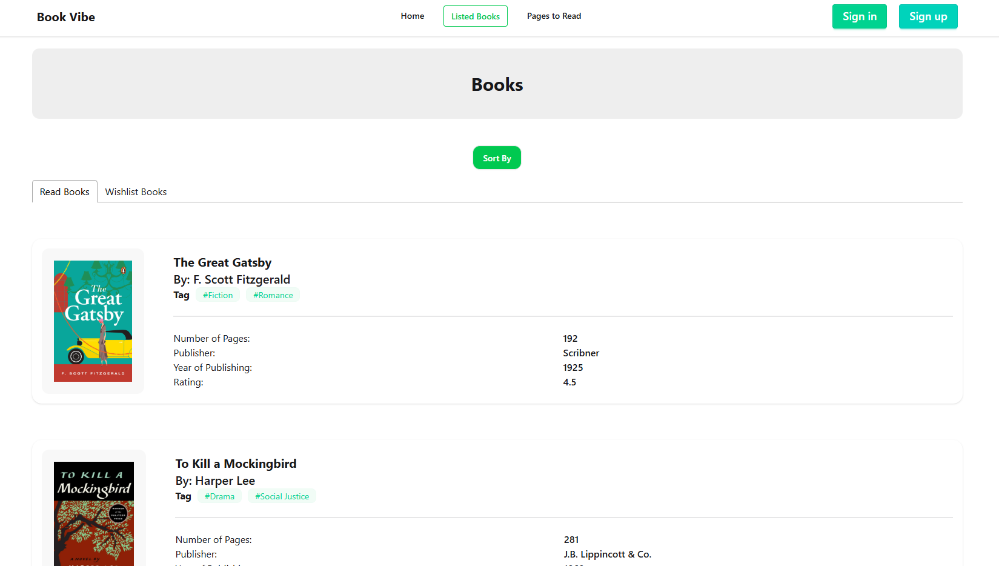
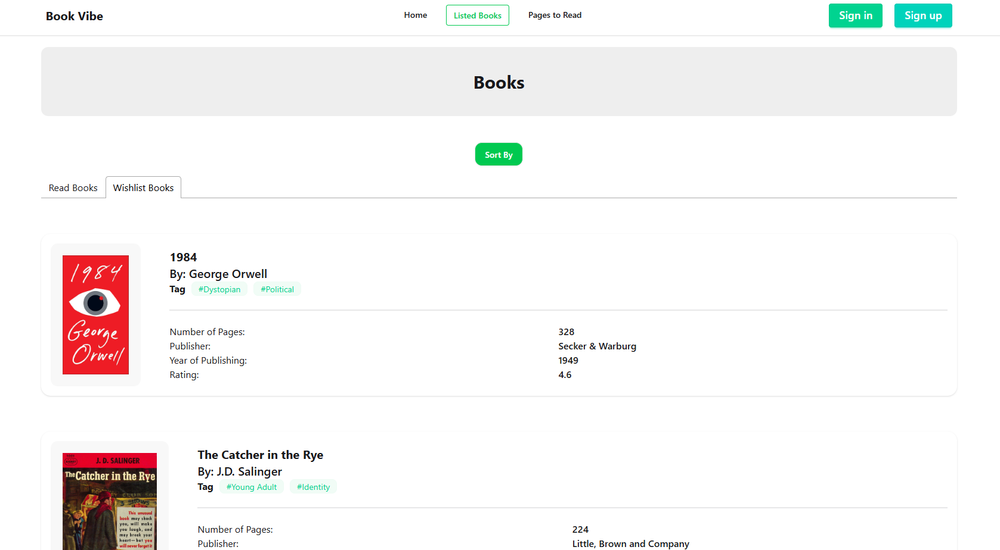
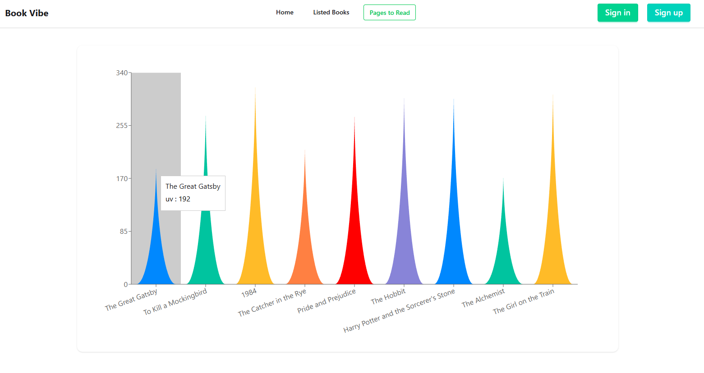
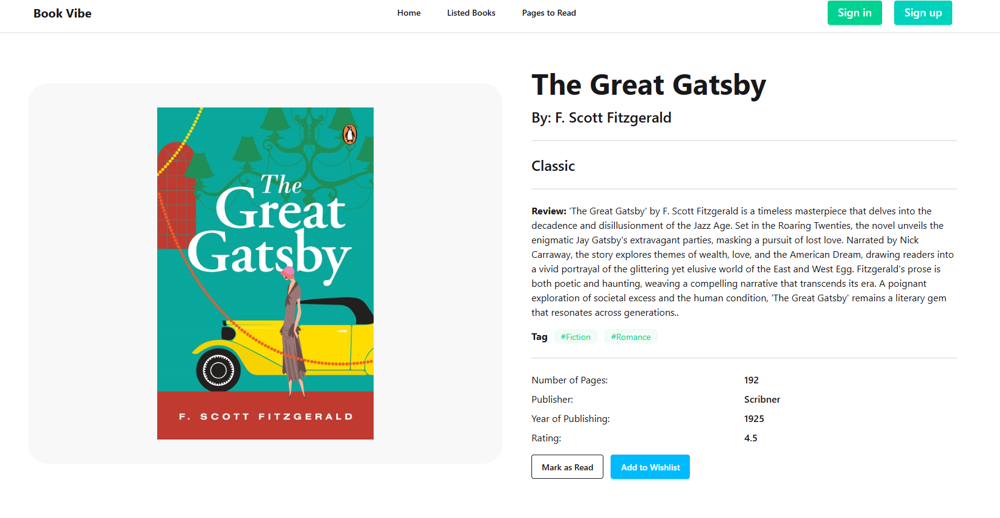

# Book Vibe 📚

Book Vibe is a responsive web application for tracking books you want to read and books you have already completed. Users can explore book details, manage reading lists, and view reading statistics in a clean and interactive interface.

## 🔗 Live Website

https://book0vibe.netlify.app/

---

## ✨ Features

- Browse and explore books
- View detailed information for each book
- Add books to a Read List
- Add books to a Wishlist
- Store reading data using browser local storage
- Sort and manage reading lists
- Visualize reading statistics with charts
- Responsive design for mobile, tablet, and desktop devices

---

## 🛠️ Technologies Used

- React
- Vite
- Tailwind CSS
- React Router
- Recharts
- React Toastify

---

## 📂 Project Structure

```bash
src/
│
├── Components/
├── Pages/
├── Context/
├── Utilities/
├── Router/
├── App.jsx
└── main.jsx
```

---

## ⚙️ Installation

Clone the project and run it locally.

```bash
# Clone repository
git clone <your-repository-link>

# Enter project directory
cd <project-folder-name>

# Install dependencies
npm install

# Start development server
npm run dev
```

---

## 📊 Main Functionalities

### Read List
Users can mark books as read and manage their completed reading list.


### Wishlist
Users can save books they want to read later.


### Statistics
Reading progress and book-related data are displayed using charts.


### Dynamic Routing
Each book has a dedicated details page using React Router.


---

## 📱 Responsive Design

The application is optimized for:
- Mobile devices
- Tablets
- Desktop screens
